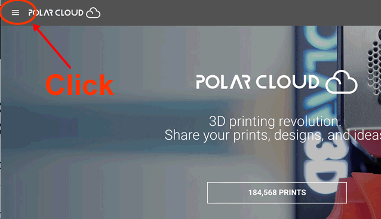
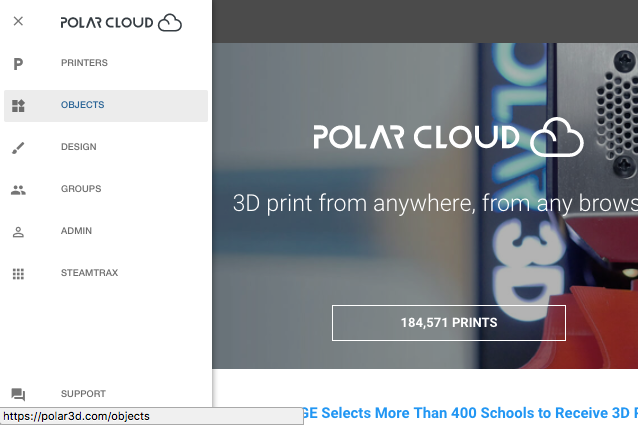
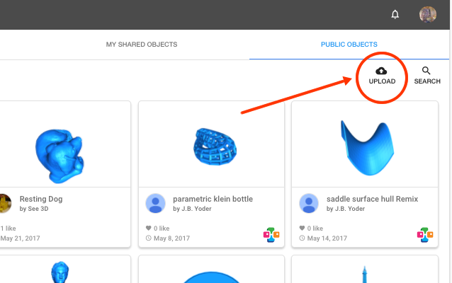
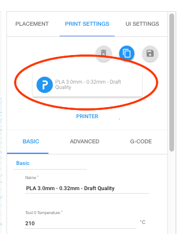
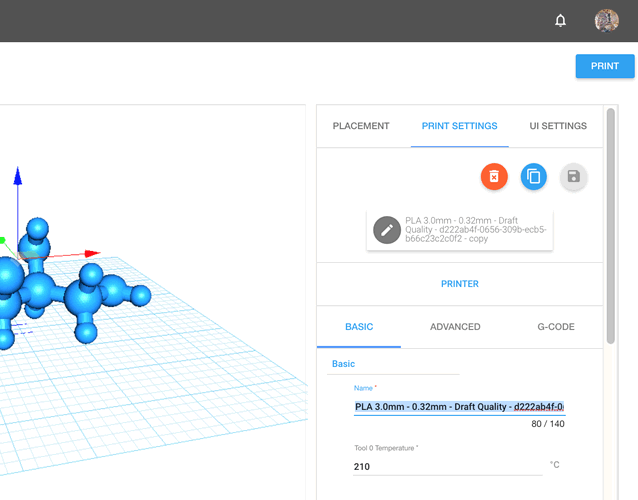
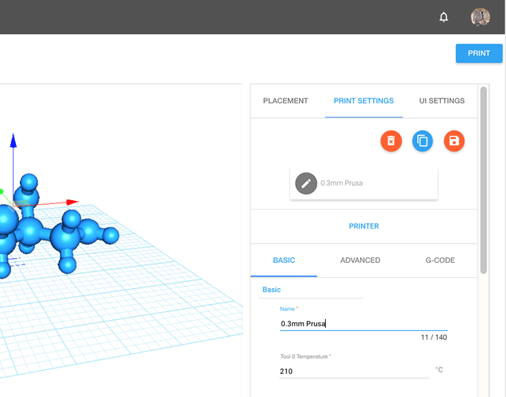

## The Polar Cloud

With the [Polar Cloud](https://polar3d.com) you can securely control your printer remotely!
(But please do be safety conscious!)

The Polar Cloud provides you with secure access to your printer from anywhere in the world, using any WebGL-capable web browser. The Polar Cloud is even tablet and phone friendly. Chromebooks and even the newest, inexpensive Amazon Fire tablets are supported.

With the Polar Cloud you can share your printers with others, granting "queue & view" access to individuals and groups. Or, grant management rights to some individuals or groups. In the Polar Cloud you can store and save STL files as well as find full information on your past prints including the slicing configuration, allowing you to requeue old print jobs.

With [Google Drive](https://drive.google.com) and [BlocksCAD](https://www.blockscad3d.com/editor), you can send STL files directly to the Polar Cloud. With [IFTTT](https://ifttt.com/polar3d) you can receive notifications when prints are queued, started, completed, finished, or even deleted from the queue.

## Configuring your Polar Cloud account

To access the [Polar Cloud](https://polar3d.com), you will need an account with Google, Facebook, or Microsoft Live: the Polar Cloud uses the "login" services of those providers to enhance security.

> Note: with Google you will be asked to approve Google Drive access as well as access to Google Classroom. The Google Drive access is to allow you to pull STLs from your Google Drive folders. The Classroom access is for the Polar Cloud's large community of school teachers who use the cloud to facilitate 3D printing activities within their physical classrooms.

If you do not have an account with Google, Facebook, or Microsoft, you will first need to create one. You can associate most any e-mail address of yours with any of those services; you do not, for example, need to create a gmail account with Google. Please refer to [this article for help creating an account with one of those three providers](https://polar3d.freshdesk.com/support/solutions/articles/9000108915-linking-your-current-email-address-to-a-google-microsoft-or-facebook-account).

When you have an account with Google, Facebook, or Microsoft Live, you're ready to log in to the Polar Cloud. Just
navigate to

> [https://polar3d.com](https://polar3d.com)

You'll be presented with a login screen with three login buttons, one for each of the providers. Click the appropriate one and login.

Your Polar Cloud account will automatically be created for you.

## Finding your account's PIN

Once logged in you should see the home page,

On the home page, click your profile image in the upper right corner and select the "Settings" menu item. This will take you to your account settings page where you can see (and change) your account's PIN number. It is located near the bottom of the settings page. You will need that PIN number when registering your Octoprint server with the Polar Cloud.

> To register an Octoprint server with the Polar Cloud, you will supply Octoprint with the e-mail address associated with your Polar Cloud account as well as your PIN number. Octoprint will connect to the cloud using SSL/TLS and provide your account information as well as a public RSA crypto key it has generated. Once your account is validated by the cloud, a unique serial number will be sent back to Octoprint. Then each time Octoprint connects to the cloud, it will authenticate itself through use of its private RSA crypto key.

## Loading a STL file to your account

Once your printer is registered, you'll want to know about the "hamburger" menu in the upper left corner of all Polar Cloud web pages. Locate it and click it,

Once clicked, a menu will appear,

From this menu you can navigate to see the printers you own, manage, or have access to. Or you can go to the pages of public, shared, and private objects as we'll next do. Groups are visited via the "groups" item.

> Note: your Octoprint service will be treated in the Polar Cloud as if it is a printer. And it will be identified by its serial number, "OPnnnnnn". You may actually have several physical printers associated with a single Octoprint server. In the Polar Cloud they will all be treated as a single printer.

## Load an object to your printer's virtual build plate

At the objects page, click the UPLOAD button near the upper right,

With the resulting upload dialog you can upload one or more STL files. They will be saved to a private object of your own and you will be given the choice of viewing the object or going to the printer's virtual build plate. Choose going to the build plate.

> Note that if you logged in using Google, you can choose to load files from Google Drive. Further, when at Google Drive, you can send STL files directly to your printer's virtual build plate by right-clicking on a STL file, selecting "Open with", and then choosing "Polar Cloud".

> Note uploaded STL files and the objects created to hold them always begin as private regardless of which tab of the objects page you are on. You must explicitly decide to share them or mark them as public in order for other people to access them. Objects can be shared with individual members or groups. Or they can be marked as public in which case any cloud member may access them.

## Printer Configuration

If, when registering your printer, you selected either the generic Cartesian or Delta printer type, you will want to do a one-time configuration of your printer. This is done by duplicating one of the default slicing profiles, giving it a friendly name, setting some printer characteristics, and then saving the configuration. Each time you then go to the virtual build plate to make a new print job or edit an existing one, your saved configuration will be amongst the configuration choices presented. Your slicer settings are also saved in the configuration. As such, you will likely create many different saved configurations.

At the virtual build plate, select the Print Settings tab near the upper right,

Then click the slicer config button shown circled in red below,

Upon clicking that button, a popup dialog will appear showing the available slicer configurations,

Click the most suitable config. Then back in the print settings, duplicate this config by clicking the duplicate icon near the upper right.

Once the config is duplicated, select the "Name" field under the "BASIC" settings tab and change the configuration's name to something more friendly,

Once you have a reasonable name, click the "PRINTER" tab directly above the "ADVANCED" tab. Once it is clicked, a dialog with printer settings will appear,

With this dialog you can control the type of build plate (rectangular or circular), the dimensions of the build volume, and whether or not the origin (0,0) in the XY-plane is at a corner of the build plate or at its center.

> The Polar Cloud centers models at (0,0). Thus, when the resulting STL is sent to your printer, it is important to know where the origin of your printer's build plate is. If it is at a corner, the Cura "posx" and "posy" settings will be set, respectively, to half the build volume's X and Y lengths.

Once you have made any adjustments to the settings, you can click "PREVIEW BUILD PLATE" button to see the adjusted build plate. Then click the "PRINTER" tab again to dismiss the dialog.

Make changes to other slicer settings as necessary. <u>And adjust your starting and ending gcode under the "GCODE" tab</u>. When you are done, save your configuration by clicking the save icon,

When you've adjusted the model on the build plate and are satisfied, click the "PRINT" button in the upper right. This will generate a single STL file containing all the models on the build plate, a rendering of your build plate, and a Cura slicing configuration. All will be stored in the cloud. The progress is displayed with a spinner in the bottom right of your screen. Once everything has been stored, you will be taken to the printer's "dashboard". From the dashboard you can start, pause, and stop prints. You can also see the queued jobs for the printer,

By clicking on the vertical dots in the upper right of a job "tile", you can perform actions on the job such as editing it to add more objects to it or to change a slicer setting,

When you edit a job, you can load additional models to it from various sources. You can even load models from another print job, thereby combing two jobs into one.
